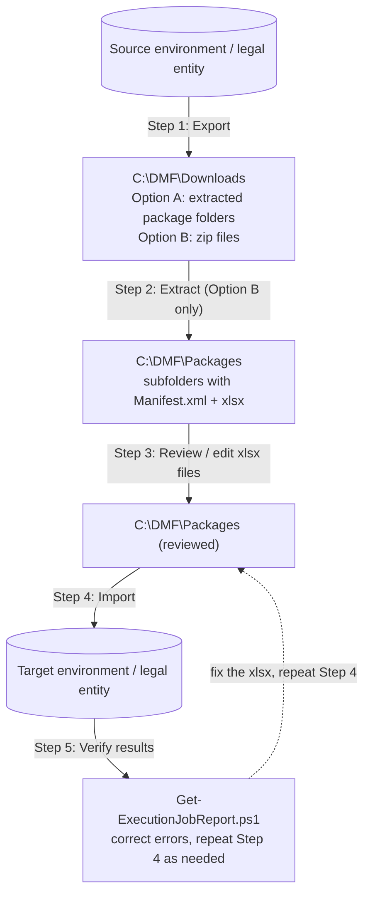

# EnvironmentDataLoader

PowerShell toolset for importing and migrating data in **Dynamics 365 Finance & Operations** via the Data Management Framework (DMF) API.

---

## Contents

- [Requirements](#requirements)
- [Repository structure](#repository-structure)
- [Authentication](#authentication)
- [Scripts](#scripts)
  - [Invoke-BaselineImport.ps1](#invoke-baselineimportps1)
  - [Invoke-TemplateExport.ps1](#invoke-templateexportps1)
  - [Invoke-ProjectExport.ps1](#invoke-projectexportps1)
  - [Expand-ExportedPackages.ps1](#expand-exportedpackagesps1)
  - [Invoke-PackageUpload.ps1](#invoke-packageuploadps1)
  - [Get-ExecutionJobReport.ps1](#get-executionjobreportps1)
  - [Export-TemplateDefinition.ps1](#export-templatedefinitionps1)
  - [Compare-EnvironmentData.ps1](#compare-environmentdataps1)
  - [Invoke-EnvironmentProbe.ps1](#invoke-environmentprobeps1)
- [Templates](#templates)
- [OData snapshots](#odata-snapshots)
- [Use cases](#use-cases)
- [Full migration pipeline](#full-migration-pipeline)
- [Entity execution ordering](#entity-execution-ordering)
- [Library modules](#library-modules)
- [Tests](#tests)

---

## Requirements

- PowerShell 5.1 or later
- Network access to the D365 F&O environment and Azure Blob Storage
- A Microsoft Entra (Azure AD) account with permissions to sign in to D365
- The **Data Management** workspace must be accessible in the target environment

---

## Repository structure

```
EnvironmentDataLoader/
├── Invoke-BaselineImport.ps1     Import local packages (xlsx + Manifest) into D365
├── Invoke-TemplateExport.ps1     Export templates to local .zip files (uses template directly)
├── Invoke-ProjectExport.ps1      Build a DMF project from template lines, then export
├── Expand-ExportedPackages.ps1   Extract downloaded .zip files into review folders
├── Invoke-PackageUpload.ps1      Upload pre-built .zip files into D365
├── Get-ExecutionJobReport.ps1    Report on execution job results; surface errors for correction
├── Export-TemplateDefinition.ps1 Capture D365 templates (incl. Microsoft defaults) into resources/<Name>/Manifest.xml
├── Compare-EnvironmentData.ps1   Diff two OData snapshot folders; HTML report + findings on the pipeline
├── Invoke-EnvironmentProbe.ps1   Verify the Metadata-service / OData behaviours the OData path relies on
├── docs/fdd/                     Functional design documents
├── docs/use-cases/               Guides: setup between two productions; open orders into UAT; package compare
├── docs/custom-packages.md       How to author a template / package by hand and mark it custom
├── tests/                        Pester tests for lib/ (Invoke-Pester ./tests)
├── data/                         OData snapshots: data/<env>/<legal entity>/<Entity>.json  (git-ignored)
├── resources/
│   ├── entity-map.json           Entity resolution cache: DMF label -> AOT name -> OData collection, keys
│   ├── 900 - Open transactions/  Hand-authored template, marked custom in template.json (use case 2)
│   └── 010 - System Setup/       A template (Manifest.xml) that is also a package (xlsx present)
│       ├── Manifest.xml
│       ├── PackageHeader.xml
│       └── *.xlsx
└── lib/
    ├── DmfAuth.ps1               Device-code sign-in, silent token refresh
    ├── DmfOData.ps1              OData URL building, escaping, paging
    ├── DmfTemplate.ps1           Manifest.xml read / validate / build / write; template folders
    ├── DmfMetadata.ps1           Entity resolution via entity-map.json + F&O Metadata service
    ├── DmfPull.ps1               OData snapshot files and the _pull.json run index
    ├── DmfCompare.ps1            Snapshot comparison engine
    ├── DmfHtml.ps1               Shared HTML report styling
    ├── DmfOutput.ps1             Console output and transcript helpers
    ├── DmfRequest.ps1            REST client with automatic retry
    ├── DmfPackage.ps1            Package discovery and entity ordering
    └── DmfZip.ps1                DMF zip inspection helpers
```

---

## Authentication

All scripts that connect to D365 sign in through Microsoft Entra.  Every script accepts `-AuthMode`:

| Mode | What happens |
|---|---|
| `Auto` (default) | On an interactive desktop the **default browser opens** on the Entra sign-in page — usually already signed in, so you just pick the account — and the script continues as soon as Entra redirects back to a listener on `http://localhost:<random port>`.  If that does not complete within three minutes, or no browser can be opened, the script falls back to the device code. |
| `Browser` | Browser only; fails instead of falling back. |
| `DeviceCode` | Prints a short code and URL to enter in any browser (RFC 8628).  Use it over SSH, in containers, or on servers without a browser: |

```
To sign in, use a web browser to open the page https://microsoft.com/devicelogin
and enter the code XXXXXXXXX to authenticate.
```

The browser flow is the standard authorization-code flow with PKCE, using the same public Azure CLI client (it permits localhost redirects), so no app registration is required.  The listener is a plain loopback socket, so it needs no administrator rights, and it only ever accepts the one redirect.  The sign-in line in the console reports who signed in and by which mode.  The token is obtained once per run and reused for all API calls in that session.

Sign-in also requests `offline_access`.  When the tenant grants it, the sign-in line reads *Silent refresh enabled* and the scripts renew the access token automatically ten minutes before it expires — on every request, including retries after a long throttling wait — so whole-environment sweeps that run longer than the token lifetime (typically 60–90 minutes) no longer fail with HTTP 401.  Should a 401 still arrive, the request renews the token and retries once before giving up.  If the tenant does not issue a refresh token the sign-in line says so and the scripts warn as expiry approaches, exactly as before.

Entra does not let a script ask for a longer access token; the refresh token is the supported mechanism, and by default it lives for days with a sliding window, subject to your tenant's Conditional Access sign-in-frequency policies.  For fully unattended runs (schedulers, CI) a service principal with client-credentials sign-in would remove the interactive step entirely; that needs an app registration and a matching entry under *System administration → Setup → Microsoft Entra ID applications* in D365, and is not implemented yet.  Tokens are held in memory only and are never written to logs or files.

**Client ID used:** `1950a258-227b-4e31-a9cf-717495945fc2` (the public Azure CLI application — no app registration required).

---

## Scripts

### Invoke-BaselineImport.ps1

Discovers package folders under a local directory, builds a DMF zip from each one, uploads it to Azure Blob Storage, and imports it into D365 via `ImportFromPackage`.

Each package folder must contain:
- `Manifest.xml` — entity definitions and file mappings
- One or more `.xlsx` files — one per entity
- *(optional)* `ordering.json` — per-package entity execution overrides

The manifest is rebuilt before upload with optimised `ExecutionUnit / LevelInExecutionUnit / SequenceInLevel` values so that independent entity chains can run in parallel inside D365 DMF.

#### Parameters

| Parameter | Required | Default | Description |
|---|---|---|---|
| `-EnvironmentUrl` | Yes | — | D365 base URL, e.g. `https://contoso.operations.dynamics.com` |
| `-TenantId` | Yes | — | Entra tenant ID or domain, e.g. `contoso.onmicrosoft.com` |
| `-LegalEntityId` | Yes | — | D365 company to import into, e.g. `DAT` |
| `-PackageName` | No | — | Import exactly this folder without showing the menu |
| `-ResourcesPath` | No | `./resources` | Root directory containing package subfolders |
| `-OutputPath` | No | `$env:TEMP` | Directory for the temporary zip files |
| `-AuthMode` | No | `Auto` | `Auto` opens the browser on an interactive desktop and falls back to the device code; `Browser`; `DeviceCode` (SSH, servers without a browser) |
| `-LogPath` | No | auto | Transcript log path; pass `''` to suppress |
| `-PollIntervalSeconds` | No | `30` | Status check interval (5–300) |
| `-TimeoutMinutes` | No | `60` | Per-package polling timeout (1–480) |
| `-MaxRetries` | No | `3` | Retry limit for transient REST failures (0–10) |
| `-Force` | No | off | Skip the confirmation prompt |
| `-WhatIf` | No | off | Validate without making any API calls |
| `-NoOverwrite` | No | off | Preserve existing D365 records |
| `-KeepZip` | No | off | Keep the generated zip after upload |
| `-PassThru` | No | off | Emit result objects: `Package, Status, ExecutionId, Elapsed` |

#### Examples

```powershell
# Interactive: discover all packages and select which to import
.\Invoke-BaselineImport.ps1 `
    -EnvironmentUrl 'https://contoso.operations.dynamics.com' `
    -TenantId       'contoso.onmicrosoft.com' `
    -LegalEntityId  'DAT'
```

```powershell
# Non-interactive: import one package, skip confirmation, write a log
.\Invoke-BaselineImport.ps1 `
    -EnvironmentUrl 'https://contoso.operations.dynamics.com' `
    -TenantId       'contoso.onmicrosoft.com' `
    -LegalEntityId  'DAT' `
    -PackageName    '010 - System Setup' `
    -Force `
    -LogPath        'C:\Logs\import.log'
```

```powershell
# Dry-run: validate all packages without touching D365
.\Invoke-BaselineImport.ps1 `
    -EnvironmentUrl 'https://contoso.operations.dynamics.com' `
    -TenantId       'contoso.onmicrosoft.com' `
    -LegalEntityId  'DAT' `
    -WhatIf
```

```powershell
# Import from a custom directory into a non-default company
.\Invoke-BaselineImport.ps1 `
    -EnvironmentUrl 'https://contoso.operations.dynamics.com' `
    -TenantId       'contoso.onmicrosoft.com' `
    -LegalEntityId  'USMF' `
    -ResourcesPath  'C:\DMF\Packages' `
    -NoOverwrite
```

---

### Invoke-TemplateExport.ps1

Reads the list of DMF definition-group templates from a D365 environment, lets you select which ones to export, submits `ExportToPackage` jobs, polls for completion, and downloads the resulting zip files.

> **Prerequisite — a data project must already exist for each template.**
> `ExportToPackage` resolves `definitionGroupId` against **data projects** (`DataManagementDefinitionGroups`), not templates (`DefinitionGroupTemplateHeaders`).  This script passes the template ID straight through, so it only succeeds for templates that have an identically-named data project in the environment.  Templates without one fail with:
>
> ```
> HTTP 400: Data project <TemplateId> does not exist.
> ```
>
> The failure is per-template — the run continues and reports the rest — but on a stock environment most templates will fail this way.  **To export templates that have no matching data project, use [`Invoke-ProjectExport.ps1`](#invoke-projectexportps1)**, which builds the project from the template lines first.  List the names this script can accept with `GET /data/DataManagementDefinitionGroups`.
>
> `-TemplateName` also accepts a **data project name** directly — for example the `"<template> <company>"` project that `Invoke-ProjectExport.ps1` leaves behind — so an existing project can be re-exported without recreating it.

#### Parameters

| Parameter | Required | Default | Description |
|---|---|---|---|
| `-EnvironmentUrl` | Yes | — | D365 base URL |
| `-TenantId` | Yes | — | Entra tenant ID or domain |
| `-LegalEntityId` | Yes | — | D365 company to export from |
| `-TemplateName` | No | — | Export exactly this template (DefinitionGroupId) without showing the menu |
| `-DownloadPath` | No | `$env:TEMP` | Directory to save downloaded zip files; pass `''` to get the URL only |
| `-AuthMode` | No | `Auto` | `Auto` opens the browser on an interactive desktop and falls back to the device code; `Browser`; `DeviceCode` (SSH, servers without a browser) |
| `-LogPath` | No | auto | Transcript log path; pass `''` to suppress |
| `-PollIntervalSeconds` | No | `30` | Status check interval (5–300) |
| `-TimeoutMinutes` | No | `60` | Per-template polling timeout (1–480) |
| `-MaxRetries` | No | `3` | Retry limit for transient REST failures (0–10) |
| `-Force` | No | off | Skip the confirmation prompt |
| `-WhatIf` | No | off | With `-TemplateName`: no API calls at all. Without: fetches the template list (read-only) for the menu, then exits without exporting |
| `-PassThru` | No | off | Emit result objects: `Template, TemplateId, Status, ExecutionId, DownloadUrl, DownloadedTo, Elapsed` |

#### Examples

```powershell
# Interactive: list all templates in the environment and choose which to export
.\Invoke-TemplateExport.ps1 `
    -EnvironmentUrl 'https://contoso.operations.dynamics.com' `
    -TenantId       'contoso.onmicrosoft.com' `
    -LegalEntityId  'DAT'
```

```powershell
# Export a specific template and download the zip to C:\DMF\Downloads
.\Invoke-TemplateExport.ps1 `
    -EnvironmentUrl 'https://contoso.operations.dynamics.com' `
    -TenantId       'contoso.onmicrosoft.com' `
    -LegalEntityId  'DAT' `
    -TemplateName   'SystemSetupExport' `
    -DownloadPath   'C:\DMF\Downloads' `
    -Force
```

```powershell
# Export several templates and capture results for further processing.
# Note: -Force skips only the "Proceed?" confirmation -- the selection menu is
# still shown.  Enter A at the prompt to pick every template.
# For an unattended all-templates sweep use Invoke-ProjectExport.ps1 -All -Force.
$exports = .\Invoke-TemplateExport.ps1 `
    -EnvironmentUrl 'https://contoso.operations.dynamics.com' `
    -TenantId       'contoso.onmicrosoft.com' `
    -LegalEntityId  'DAT' `
    -DownloadPath   'C:\DMF\Downloads' `
    -Force `
    -PassThru

$exports | Where-Object Status -eq 'Succeeded' | Select-Object TemplateId, DownloadedTo
```

```powershell
# WhatIf with a named template — zero API calls, no authentication needed
.\Invoke-TemplateExport.ps1 `
    -EnvironmentUrl 'https://contoso.operations.dynamics.com' `
    -TenantId       'contoso.onmicrosoft.com' `
    -LegalEntityId  'DAT' `
    -TemplateName   'SystemSetupExport' `
    -WhatIf
```

---

### Invoke-ProjectExport.ps1

Builds a dedicated DMF export project from a template's entity lines, then exports and downloads it.  Unlike `Invoke-TemplateExport.ps1` — which runs `ExportToPackage` directly against the template — this script first creates a named DMF project (`DataManagementDefinitionGroups`) populated with one entity record per template line, then exports that project.

Templates come from **local folders by default** (`-TemplateSource Local`, see [Templates](#templates)) or from the environment (`-TemplateSource Environment`).  With `-Mode OData` the same entities are read straight from the OData endpoints into JSON instead of running a DMF export job — see [OData snapshots](#odata-snapshots).

Because it creates the data project itself, this script works for **every** template — including the ones `Invoke-TemplateExport.ps1` cannot export because no matching data project exists.  It is the right choice for exporting a whole environment; use it when you need a persistent, inspectable DMF project in D365 that matches the template structure, or when `Invoke-TemplateExport.ps1` fails with *"Data project ... does not exist."*

Note that it **writes to the source environment**: one data project is created per template, and any existing project with the same name is deleted first.  Templates that have no lines are reported as `Skipped` rather than exported.

**Per-template flow:**
1. Fetch all lines from `DefinitionGroupTemplateLines` for the selected template.
2. Delete any existing DMF project named `"<TemplateId> <LegalEntityId>"` (404 is silently ignored).
3. Create a fresh export project with that name.
4. `POST` one entity record to `DataManagementDefinitionGroupDetails` per template line.
5. Submit `ExportToPackage`, poll for completion, download the zip and **extract it** into `<DownloadPath>\<TemplateId>-<LegalEntity>_<timestamp>\` (the zip is deleted after extraction).  The folder is a ready package: `Manifest.xml`, `PackageHeader.xml` and one xlsx per entity, importable by `Invoke-BaselineImport.ps1` and usable as a template.

#### Parameters

| Parameter | Required | Default | Description |
|---|---|---|---|
| `-EnvironmentUrl` | Yes | — | D365 base URL |
| `-TenantId` | Yes | — | Entra tenant ID or domain |
| `-LegalEntityId` | No | prompted | D365 company to export from; prompted interactively if omitted |
| `-TemplateName` | No | — | Process exactly this template (TemplateId) without showing the menu |
| `-All` | No | off | Process every validated template without showing the menu; cannot be combined with `-TemplateName`. With `-Force` it also requires `-LegalEntityId` |
| `-TemplateSource` | No | `Local` | `Local` lists template folders under `-ResourcesPath`; `Environment` lists the environment's validated templates |
| `-ResourcesPath` | No | `./resources` | Root scanned for template folders; also holds `entity-map.json` |
| `-Mode` | No | `Dmf` | `Dmf` creates a DMF project and exports a package; `OData` reads the entities via OData into JSON |
| `-DataPath` | No | `./data` | OData mode: root for `<env>/<legal entity>/` snapshot folders |
| `-MaxRecordsPerEntity` | No | `0` | OData mode: per-entity safety cap (0 = unlimited); a capped entity is written truncated and reported as `Truncated` |
| `-RefreshEntityMap` | No | off | OData mode: ignore cached resolutions and re-query the Metadata service (manual entries are kept) |
| `-IncludeDisabled` | No | off | Include manifest lines marked `Disable=true` (local templates) |
| `-DownloadPath` | No | `$PWD` | Dmf mode: directory that receives one extracted package folder per template (created if missing); pass `''` to get the URL only |
| `-AuthMode` | No | `Auto` | `Auto` opens the browser on an interactive desktop and falls back to the device code; `Browser`; `DeviceCode` (SSH, servers without a browser) |
| `-LogPath` | No | auto | Transcript log path; pass `''` to suppress |
| `-PollIntervalSeconds` | No | `30` | Status check interval (5–300) |
| `-TimeoutMinutes` | No | `60` | Per-template polling timeout (1–480) |
| `-MaxRetries` | No | `3` | Retry limit for transient REST failures (0–10) |
| `-Force` | No | off | Skip the confirmation prompt |
| `-WhatIf` | No | off | With `-TemplateName`: no API calls at all. Without: fetches the template list (read-only) for the menu, then exits without creating or exporting |
| `-PassThru` | No | off | Dmf mode, one object per template: `Template, TemplateId, ProjectName, LegalEntityId, Status, LinesAdded, ExecutionId, DownloadUrl, DownloadedTo, Elapsed`. OData mode, one per entity: `Templates, Entity, TargetEntity, Collection, LegalEntityId, Status, Reason, RecordCount, File, Elapsed` |

With `-TemplateSource Local` and `-WhatIf` the script makes **no API calls at all** (the template list is local); with `-Mode OData -WhatIf` it additionally shows, per entity, how it would resolve from `entity-map.json` and which file would be written.

#### Examples

```powershell
# Pull every entity of a local template via OData into .\data\<env>\USMF\
.\Invoke-ProjectExport.ps1 `
    -EnvironmentUrl 'https://contoso-uat.sandbox.operations.dynamics.com' `
    -TenantId       'contoso.onmicrosoft.com' `
    -LegalEntityId  'USMF' `
    -TemplateName   '010 - System Setup' `
    -Mode           OData
```

```powershell
# Whole environment via OData: the union of every local template, unattended
.\Invoke-ProjectExport.ps1 -EnvironmentUrl 'https://contoso.operations.dynamics.com' -TenantId 'contoso.onmicrosoft.com' `
    -LegalEntityId 'USMF' -All -Mode OData -Force -PassThru |
    Where-Object Status -ne 'Pulled' | Format-Table Entity, Status, Reason
```

```powershell
# Interactive: list templates, prompt for selection and legal entity
.\Invoke-ProjectExport.ps1 `
    -EnvironmentUrl 'https://contoso.operations.dynamics.com' `
    -TenantId       'contoso.onmicrosoft.com'
```

```powershell
# Supply legal entity up front, select templates interactively
.\Invoke-ProjectExport.ps1 `
    -EnvironmentUrl 'https://contoso.operations.dynamics.com' `
    -TenantId       'contoso.onmicrosoft.com' `
    -LegalEntityId  'USMF'
```

```powershell
# Non-interactive: one template, skip confirmation, download to C:\DMF\Downloads
.\Invoke-ProjectExport.ps1 `
    -EnvironmentUrl 'https://contoso.operations.dynamics.com' `
    -TenantId       'contoso.onmicrosoft.com' `
    -LegalEntityId  'USMF' `
    -TemplateName   '010 - System Setup' `
    -DownloadPath   'C:\DMF\Downloads' `
    -Force
```

```powershell
# WhatIf with a named template — zero API calls
.\Invoke-ProjectExport.ps1 `
    -EnvironmentUrl 'https://contoso.operations.dynamics.com' `
    -TenantId       'contoso.onmicrosoft.com' `
    -LegalEntityId  'USMF' `
    -TemplateName   '010 - System Setup' `
    -WhatIf
```

```powershell
# Export multiple templates and capture results
$results = .\Invoke-ProjectExport.ps1 `
    -EnvironmentUrl 'https://contoso.operations.dynamics.com' `
    -TenantId       'contoso.onmicrosoft.com' `
    -LegalEntityId  'USMF' `
    -DownloadPath   'C:\DMF\Downloads' `
    -Force `
    -PassThru

$results | Select-Object ProjectName, LinesAdded, Status, DownloadedTo
```

```powershell
# Every template in the environment, fully unattended (no selection menu)
$results = .\Invoke-ProjectExport.ps1 `
    -EnvironmentUrl 'https://contoso.operations.dynamics.com' `
    -TenantId       'contoso.onmicrosoft.com' `
    -LegalEntityId  'USMF' `
    -DownloadPath   'C:\DMF\Downloads' `
    -PollIntervalSeconds 10 `
    -All `
    -Force `
    -PassThru

# Anything that did not succeed can be re-run individually with -TemplateName
$results | Where-Object Status -notin 'Succeeded', 'Skipped' |
    Format-Table TemplateId, Status, ExecutionId
```

```powershell
# Preview an all-templates sweep -- read-only, nothing created or exported
.\Invoke-ProjectExport.ps1 `
    -EnvironmentUrl 'https://contoso.operations.dynamics.com' `
    -TenantId       'contoso.onmicrosoft.com' `
    -LegalEntityId  'USMF' `
    -All `
    -WhatIf
```

---

### Expand-ExportedPackages.ps1

Extracts downloaded DMF package zip files into individual subfolders.  Each subfolder becomes a self-contained package directory (Manifest.xml + xlsx files) that `Invoke-BaselineImport.ps1` can import directly.

This is the **review step** in the migration pipeline: after extraction you can open, edit, or filter the xlsx files before re-importing into a target environment.

No D365 API calls are made — this script is entirely local.

#### Parameters

| Parameter | Required | Default | Description |
|---|---|---|---|
| `-SourcePath` | Yes | — | Directory containing downloaded `.zip` files |
| `-DestinationPath` | No | `SourcePath` | Root directory where per-package subfolders are created |
| `-PackageName` | No | — | Extract exactly this zip (with or without `.zip` extension) without showing the menu |
| `-Force` | No | off | Delete and re-extract if the destination folder already exists |
| `-WhatIf` | No | off | Show what would be extracted without writing any files |
| `-PassThru` | No | off | Emit result objects: `Package, DefinitionGroupId, ExtractedTo, XlsxCount, EntityCount, Status` |

Destination subfolders are named after the zip filename (without extension), preserving the timestamp so multiple exports of the same template do not collide.  Existing folders are shown in the menu in cyan; they are skipped unless `-Force` is specified.

#### Examples

```powershell
# Interactive: list all zips in the download folder and choose which to extract
.\Expand-ExportedPackages.ps1 `
    -SourcePath      'C:\DMF\Downloads' `
    -DestinationPath 'C:\DMF\Packages'
```

```powershell
# Extract everything, overwriting any folders that already exist
.\Expand-ExportedPackages.ps1 `
    -SourcePath      'C:\DMF\Downloads' `
    -DestinationPath 'C:\DMF\Packages' `
    -Force
```

```powershell
# Extract a single zip
.\Expand-ExportedPackages.ps1 `
    -SourcePath      'C:\DMF\Downloads' `
    -DestinationPath 'C:\DMF\Packages' `
    -PackageName     'SystemSetupExport_20240101120000'
```

```powershell
# WhatIf: preview extraction targets without writing anything
.\Expand-ExportedPackages.ps1 `
    -SourcePath 'C:\DMF\Downloads' `
    -WhatIf
```

---

### Invoke-PackageUpload.ps1

Uploads pre-built DMF package zip files directly to D365 without rebuilding the manifest.  Use this when you have complete, ready-to-import zips — for example, packages downloaded directly from another environment or obtained from a third party.

The definition group ID used in the `ImportFromPackage` call is read from `Manifest.xml` inside each zip, so the package is imported exactly as assembled.

#### Parameters

| Parameter | Required | Default | Description |
|---|---|---|---|
| `-EnvironmentUrl` | Yes | — | D365 base URL |
| `-TenantId` | Yes | — | Entra tenant ID or domain |
| `-LegalEntityId` | Yes | — | D365 company to import into |
| `-UploadPath` | Yes | — | Directory containing the `.zip` files to upload |
| `-PackageName` | No | — | Upload exactly this zip (with or without `.zip` extension) without showing the menu |
| `-AuthMode` | No | `Auto` | `Auto` opens the browser on an interactive desktop and falls back to the device code; `Browser`; `DeviceCode` (SSH, servers without a browser) |
| `-LogPath` | No | auto | Transcript log path; pass `''` to suppress |
| `-PollIntervalSeconds` | No | `30` | Status check interval (5–300) |
| `-TimeoutMinutes` | No | `60` | Per-package polling timeout (1–480) |
| `-MaxRetries` | No | `3` | Retry limit for transient REST failures (0–10) |
| `-Force` | No | off | Skip the confirmation prompt |
| `-WhatIf` | No | off | Validate packages locally without making any API calls |
| `-NoOverwrite` | No | off | Preserve existing D365 records |
| `-PassThru` | No | off | Emit result objects: `Package, DefinitionGroupId, Status, ExecutionId, Elapsed` |

#### Examples

```powershell
# Interactive: list all zips in the folder and choose which to upload
.\Invoke-PackageUpload.ps1 `
    -EnvironmentUrl 'https://contoso.operations.dynamics.com' `
    -TenantId       'contoso.onmicrosoft.com' `
    -LegalEntityId  'DAT' `
    -UploadPath     'C:\DMF\Downloads'
```

```powershell
# Upload one specific package, skip confirmation, preserve existing records
.\Invoke-PackageUpload.ps1 `
    -EnvironmentUrl 'https://contoso.operations.dynamics.com' `
    -TenantId       'contoso.onmicrosoft.com' `
    -LegalEntityId  'USMF' `
    -UploadPath     'C:\DMF\Downloads' `
    -PackageName    'SystemSetupExport_20240101120000.zip' `
    -NoOverwrite `
    -Force
```

```powershell
# Dry-run: validate all zips in the directory without connecting to D365
.\Invoke-PackageUpload.ps1 `
    -EnvironmentUrl 'https://contoso.operations.dynamics.com' `
    -TenantId       'contoso.onmicrosoft.com' `
    -LegalEntityId  'DAT' `
    -UploadPath     'C:\DMF\Downloads' `
    -WhatIf
```

---

### Get-ExecutionJobReport.ps1

Queries the D365 OData API for all `DataManagementExecutionJobs` whose `Description` begins with `Copy legal entity` and produces a professional, self-contained HTML report of every per-entity `DataManagementExecutionJobDetails` record, as well as a colour-coded console summary.

The HTML report includes summary cards (jobs, entities, clean/warning/error counts, failed records), source and target legal entity parsed from each job description, and a single table with all entity rows grouped by job.  Designed to be run after an import — share the HTML file with the team, correct source data for flagged entities, and re-run as many times as needed.

**Row colour coding:**

| Colour | Meaning |
|---|---|
| Green | Both staging and target finished with no failed records — no action needed |
| Yellow | Non-error anomaly or failed-record count > 0 — review recommended |
| Red | Staging or target error / aborted — manual data correction required |

For any job that contains a red entity, the script additionally calls `GetExecutionSummaryStatus` from the D365 Data Management API to retrieve and display the platform-level execution result alongside the Execution ID for drill-down in **D365 > Data management > Job history**.

#### Parameters

| Parameter | Required | Default | Description |
|---|---|---|---|
| `-EnvironmentUrl` | Yes | — | D365 base URL, e.g. `https://contoso.operations.dynamics.com` |
| `-TenantId` | Yes | — | Entra tenant ID or domain, e.g. `contoso.onmicrosoft.com` |
| `-AuthMode` | No | `Auto` | `Auto` opens the browser on an interactive desktop and falls back to the device code; `Browser`; `DeviceCode` (SSH, servers without a browser) |
| `-LogPath` | No | auto | Transcript log path; pass `''` to suppress |
| `-HtmlPath` | No | auto | HTML report path; pass `''` to suppress HTML output |
| `-MaxRetries` | No | `3` | Retry limit for transient REST failures (0–10) |
| `-IssuesOnly` | No | off | Show only rows that need attention in both the console table and the HTML report; clean rows are still counted in the summary cards |
| `-PassThru` | No | off | Emit enriched detail objects to the pipeline (see below) |

`-PassThru` objects include: `JobId`, `JobDescription`, `DefinitionGroupId`, `EntityName`, `StagingStatus`, `TargetStatus`, `StagingRecordsToBeProcessedCount`, `TargetRecordsCreatedCount`, `TargetRecordsUpdatedCount`, `FailedRecords`, `NeedsAttention`.

#### Examples

```powershell
# Full report for all three-digit-prefix jobs
.\Get-ExecutionJobReport.ps1 `
    -EnvironmentUrl 'https://contoso.operations.dynamics.com' `
    -TenantId       'contoso.onmicrosoft.com'
```

```powershell
# Issues only -- save HTML to a specific path for sharing with the team
.\Get-ExecutionJobReport.ps1 `
    -EnvironmentUrl 'https://contoso.operations.dynamics.com' `
    -TenantId       'contoso.onmicrosoft.com' `
    -IssuesOnly `
    -HtmlPath       'C:\Reports\job_report.html'
```

```powershell
# Full report; explicit paths for both the HTML and the log
.\Get-ExecutionJobReport.ps1 `
    -EnvironmentUrl 'https://contoso.operations.dynamics.com' `
    -TenantId       'contoso.onmicrosoft.com' `
    -HtmlPath       'C:\Reports\job_report.html' `
    -LogPath        'C:\Reports\job_report.log'
```

```powershell
# Export all detail records to CSV for external tracking; suppress HTML
.\Get-ExecutionJobReport.ps1 `
    -EnvironmentUrl 'https://contoso.operations.dynamics.com' `
    -TenantId       'contoso.onmicrosoft.com' `
    -HtmlPath       '' `
    -PassThru |
    Export-Csv -Path 'C:\Reports\job_report.csv' -NoTypeInformation
```

---

### Export-TemplateDefinition.ps1

Captures DMF templates from an environment into local template folders — `resources/<TemplateId>/Manifest.xml` plus `PackageHeader.xml` and a `template.json` sidecar with provenance (`"origin": "captured"`, source environment, capture time, per-line module / tags / category).  This is how Microsoft's default templates are brought into the repo: load them in D365 first (*Data management → Templates → Load default templates*), then run the script once with `-All`.

During capture every entity is resolved through `entity-map.json` and the F&O Metadata service, so each manifest line gets its `TargetEntity` (AOT name) and the map gains the OData collection, key fields and company-specific flag.  A captured template is therefore immediately usable with `Invoke-ProjectExport.ps1 -Mode OData`.  Unresolved labels are reported, not fatal.

`-SeedFromPath` harvests `EntityName → TargetEntity` pairs from any `Manifest.xml` already on disk (for example expanded exports) into the map without signing in; on its own it is a complete run.

#### Parameters

| Parameter | Required | Default | Description |
|---|---|---|---|
| `-EnvironmentUrl` | Yes | — | D365 base URL |
| `-TenantId` | Yes | — | Entra tenant ID or domain |
| `-TemplateName` | No | — | Capture exactly this template; skips the menu |
| `-All` | No | off | Capture every validated template; skips the menu |
| `-ResourcesPath` | No | `./resources` | Where `<TemplateId>/` folders and `entity-map.json` are written |
| `-SeedFromPath` | No | — | Folder(s) scanned recursively for `Manifest.xml` to seed the entity map; usable alone |
| `-Force` | No | off | Overwrite an existing folder's manifest, header and sidecar (`.xlsx` files are never touched).  A folder marked `"origin": "custom"` in `template.json` is never overwritten |
| `-NoResolve` | No | off | Skip Metadata-service resolution |
| `-NoSidecar` | No | off | Do not write `template.json` |
| `-Language` | No | `en-US` | Label language used for resolution |
| `-AuthMode` | No | `Auto` | `Auto` opens the browser on an interactive desktop and falls back to the device code; `Browser`; `DeviceCode` (SSH, servers without a browser) |
| `-LogPath` | No | auto | Transcript path; `''` suppresses |
| `-MaxRetries` | No | `3` | Retry limit for transient REST failures |
| `-WhatIf` | No | off | With `-TemplateName`: no API calls; otherwise the template list is fetched for the menu and nothing is written |
| `-PassThru` | No | off | One object per template: `TemplateId, Description, Lines, Resolved, Unresolved, Folder, Status, Elapsed` |

Statuses: `Captured`, `Skipped-Exists` (re-run with `-Force`), `Skipped-Custom` (the folder is a [custom template](#custom-templates)), `Skipped-NoLines`, `Failed`.

#### Examples

```powershell
# Capture every template after loading the Microsoft defaults in D365
.\Export-TemplateDefinition.ps1 -EnvironmentUrl 'https://contoso.operations.dynamics.com' -TenantId 'contoso.onmicrosoft.com' -All
```

```powershell
# Seed the entity map from expanded exports, no sign-in
.\Export-TemplateDefinition.ps1 -EnvironmentUrl 'https://contoso.operations.dynamics.com' -TenantId 'contoso.onmicrosoft.com' -SeedFromPath 'C:\DMF\Packages'
```

---

### Compare-EnvironmentData.ps1

Compares two OData snapshot folders produced by `Invoke-ProjectExport.ps1 -Mode OData` and reports entities present on one side only, records added / removed / changed (by the entity's OData key stored in each file), the exact fields that moved, schema drift, and duplicate keys.  Entirely local — no sign-in.

Values are normalised before comparison unless `-Strict`: blanks equal null, `Yes`/`No` equal `true`/`false`, `1.50` equals `1.5`, ISO dates compare as instants, and the D365 "no date" sentinel (`1900-01-01`) equals null.  Ignored by default: `@odata.etag`, the `Created*` / `Modified*` audit fields, and `RecId` / `RecVersion`-style surrogates; `dataAreaId` **is** compared unless you add it to `-IgnoreFields` (useful when diffing two companies).  An ignored field is also dropped from the key.

Outputs a colour-coded console table, a **per-template (package) roll-up** built from what each side's `_pull.json` says pulled each entity, a self-contained HTML report (summary cards, package table, coverage, per-entity sections with a client-side filter box), an optional JSON delta, and with `-PassThru` one object per finding for `Export-Csv`.

The typical question is "how does package X's data differ between prod and UAT":

```powershell
# pull the same package from both environments into C:\DMF\<env>\USMF\ ...
.\Invoke-ProjectExport.ps1 -EnvironmentUrl 'https://contoso-prod.operations.dynamics.com' -TenantId 'contoso.onmicrosoft.com' -LegalEntityId 'USMF' -TemplateName '010 - System Setup' -Mode OData -DataPath 'C:\DMF' -Force
.\Invoke-ProjectExport.ps1 -EnvironmentUrl 'https://contoso-uat.sandbox.operations.dynamics.com' -TenantId 'contoso.onmicrosoft.com' -LegalEntityId 'USMF' -TemplateName '010 - System Setup' -Mode OData -DataPath 'C:\DMF' -Force

# ... then compare the two folders
.\Compare-EnvironmentData.ps1 -Folder1 'C:\DMF\contoso-prod\USMF' -Folder2 'C:\DMF\contoso-uat\USMF'
```

Folder 1 is the baseline (Reference); rows only in folder 2 are *Added*, rows only in folder 1 are *Removed*.  Pull several packages into the same folders over time and use `-Template` to look at one of them.  The full walkthrough — pulling both sides, reading each output, what to ignore, two companies, before/after snapshots, and the CI gate — is [use case 3](docs/use-cases/03-compare-a-package-between-environments.md).

#### Parameters

| Parameter | Required | Default | Description |
|---|---|---|---|
| `-ReferencePath` / `-DifferencePath` | one form | — | Full paths of the baseline and examined folders.  Aliases: `-Folder1` / `-Folder2`, `-Path1` / `-Path2`, `-Baseline` / `-Target` |
| `-Reference` / `-Difference` | one form | — | `<env>/<LE>` shorthand resolved under `-DataPath` |
| `-DataPath` | No | `./data` | Root for the shorthand form |
| `-Entity` | No | all | Entity labels, wildcards allowed |
| `-Template` | No | all | Template (package) names, wildcards allowed; keeps the entities that either side's `_pull.json` attributes to them |
| `-IgnoreFields` | No | — | Field names or wildcards added to the defaults |
| `-NoDefaultIgnores` | No | off | Compare every field |
| `-KeyOverride` | No | — | `@{ 'Entity label' = 'Field1','Field2' }` to replace the stored key |
| `-Strict` | No | off | Raw text comparison, no normalisation |
| `-ChangesOnly` | No | off | Hide identical entities |
| `-MaxRowsPerEntity` | No | `500` | Cap on rows rendered per entity in the HTML |
| `-HtmlPath` | No | auto | HTML report path; `''` suppresses |
| `-JsonPath` | No | — | Write the machine-readable delta |
| `-LogPath` | No | auto | Transcript path; `''` suppresses |
| `-PassThru` | No | off | One object per finding: `Entity, ChangeType, Key, Field, ReferenceValue, DifferenceValue, Record` |
| `-FailOnDifference` | No | off | Exit code 2 when any difference exists (for CI) |

`ChangeType` values: `Added`, `Removed`, `Changed`, `EntityOnlyInReference`, `EntityOnlyInDifference`, `SchemaDrift`, `KeyCollision`.

#### Examples

```powershell
.\Compare-EnvironmentData.ps1 -Reference 'contoso-uat/USMF' -Difference 'contoso-prod/USMF'
```

```powershell
# Field-level changes for a few entities, to CSV
.\Compare-EnvironmentData.ps1 -Reference 'contoso-uat/USMF' -Difference 'contoso-prod/USMF' `
    -Entity 'Currencies', 'Number sequence*' -PassThru |
    Where-Object ChangeType -eq 'Changed' | Export-Csv delta.csv -NoTypeInformation
```

```powershell
# Two companies in one environment
.\Compare-EnvironmentData.ps1 -Reference 'contoso-uat/USMF' -Difference 'contoso-uat/DAT' -IgnoreFields dataAreaId
```

---

### Invoke-EnvironmentProbe.ps1

Runs six read-only checks against an environment to confirm the platform behaviours that the OData path (`Invoke-ProjectExport.ps1 -Mode OData` and its entity resolution) depends on, and writes the evidence as a JSON file plus a Markdown summary to keep with the environment's notes.  Run it once per environment before relying on the OData path there; nothing is created or changed in D365.

| Probe | What it checks |
|---|---|
| V1 | `/Metadata/DataEntities` exposes `Name`, `PublicEntityName`, `PublicCollectionName`, `LabelId`, `DataServiceEnabled`, `DataManagementEnabled`, `EntityCategory`; records the row count and whether `$filter` works |
| V2 | `/Metadata/PublicEntities` returns `Properties[]` with `IsKey`, and `dataAreaId` appears on the company-specific entity but not the shared one |
| V3 | `/Metadata/Labels` accepts an `or`-chained `Id` filter with a `Language` filter |
| V4 | A DMF template line label matches the data entity's own label (reverse lookup by label text, with a forward-lookup fallback) |
| V5 | `cross-company=true` plus `$filter=dataAreaId eq '<LE>'` returns that company's rows; also records what the same query returns without `cross-company` |
| V6 | Device-code sign-in with `offline_access` returns a `refresh_token` (only its presence and length are recorded, never the value) |

#### Parameters

| Parameter | Required | Default | Description |
|---|---|---|---|
| `-EnvironmentUrl` | Yes | — | D365 base URL |
| `-TenantId` | Yes | — | Entra tenant ID or domain |
| `-LegalEntityId` | Yes | — | Company for the cross-company probe. Use one that is **not** your default company and has rows in `-CompanyCollection` |
| `-SharedEntity` | No | `Currency` | Public entity name of an entity without `dataAreaId` |
| `-CompanyEntity` | No | `CustomerGroup` | Public entity name of a company-specific entity |
| `-CompanyCollection` | No | `CustomerGroups` | Collection (entity set) name for the company-specific entity |
| `-Language` | No | `en-US` | Label language |
| `-SampleSize` | No | `5` | Rows sampled per probe (1–50) |
| `-OutputPath` | No | `$env:TEMP` | Where the `.json` and `.md` files go; pass `''` for console only |
| `-AuthMode` | No | `Auto` | `Auto` opens the browser on an interactive desktop and falls back to the device code; `Browser`; `DeviceCode` (SSH, servers without a browser) |
| `-LogPath` | No | auto | Transcript path; pass `''` to suppress |
| `-MaxRetries` | No | `1` | Retry limit for transient REST failures (0–10) |
| `-WhatIf` | No | off | List the requests that would be made; no sign-in, no API calls |
| `-PassThru` | No | off | Emit one object per probe: `Id, Title, Result, Detail, ElapsedMs, Requests, Observed` |

Each probe reports `PASS`, `FAIL`, `INCONCLUSIVE` (the environment could not give a clear answer, usually because a chosen entity has no data), or `SKIP`.

#### Examples

```powershell
# Run all probes and keep the results with the environment's notes
.\Invoke-EnvironmentProbe.ps1 `
    -EnvironmentUrl 'https://contoso-uat.sandbox.operations.dynamics.com' `
    -TenantId       'contoso.onmicrosoft.com' `
    -LegalEntityId  'USMF' `
    -OutputPath     'C:\DMF\probes'
```

```powershell
# CustomerGroups is empty in this company -- probe with vendor groups instead
.\Invoke-EnvironmentProbe.ps1 `
    -EnvironmentUrl    'https://contoso.operations.dynamics.com' `
    -TenantId          'contoso.onmicrosoft.com' `
    -LegalEntityId     'DEMF' `
    -CompanyEntity     'VendorGroup' `
    -CompanyCollection 'VendorGroups'
```

```powershell
# Preview the requests without signing in
.\Invoke-EnvironmentProbe.ps1 `
    -EnvironmentUrl 'https://contoso.operations.dynamics.com' `
    -TenantId       'contoso.onmicrosoft.com' `
    -LegalEntityId  'USMF' `
    -WhatIf
```

---

## Templates

A **template** is a folder under `resources/` that contains a `Manifest.xml` in the DMF package-manifest format — the same file D365 writes into every exported package.  If `.xlsx` files are present alongside, the folder is also an importable **package** for `Invoke-BaselineImport.ps1`; without them it is a template only (the import menu shows it as *Template only*).  The folder name is the template ID used in menus, `-TemplateName`, and DMF project names.

Ways to get templates:

- **Capture from an environment** with `Export-TemplateDefinition.ps1` — including Microsoft's defaults after *Load default templates*.
- **Drop an expanded export** (`Expand-ExportedPackages.ps1` output) under `resources/`.
- **Author one by hand.**  Only `EntityName` and the three ordering values are required per line; everything else takes defaults.  `TargetEntity` (the AOT entity name) is optional — the OData path resolves it.  `resources/900 - Open transactions` is a hand-authored example: six order entities, headers at level 10 and lines at level 20 (see [use case 2](docs/use-cases/02-open-transactions-prod-to-uat.md)).

```xml
<DataManagementPackageManifest xmlns="http://schemas.microsoft.com/dynamics/2015/01/DataManagement">
  <DefinitionGroupName>Customer - Retail baseline</DefinitionGroupName>
  <Description>Retail setup needed before store go-live</Description>
  <PackageEntityList>
    <DataManagementPackageEntityData>
      <EntityName>Currencies</EntityName>
      <ExecutionUnit>1</ExecutionUnit>
      <LevelInExecutionUnit>10</LevelInExecutionUnit>
      <SequenceInLevel>10</SequenceInLevel>
    </DataManagementPackageEntityData>
  </PackageEntityList>
</DataManagementPackageManifest>
```

Validate a hand-written template without touching D365:

```powershell
.\Invoke-ProjectExport.ps1 -EnvironmentUrl 'https://x.operations.dynamics.com' -TenantId 'x' -LegalEntityId 'USMF' -TemplateName 'Customer - Retail baseline' -WhatIf
```

A manifest that is valid as a template may be too thin to import as a package (no field maps); that is fine — data files only ever come from D365 exports, which carry full manifests.  Set `<Disable>true</Disable>` on a line to leave it out of exports and pulls without deleting it (`-IncludeDisabled` restores it).

### Custom templates

Mark a hand-authored folder as **custom** with a `template.json` sidecar next to the manifest:

```json
{
  "schemaVersion": 1,
  "templateId": "900 - Open transactions",
  "origin": "custom",
  "description": "Open sales orders, open purchase orders and transfer orders not yet shipped",
  "notes": "Hand-authored. Status filters must be set on the export data project."
}
```

What the marker does:

- menus show the folder as `<name>  [custom]` (`Invoke-BaselineImport.ps1`) or `custom, N lines` (`Invoke-ProjectExport.ps1`), and `Get-TemplateInfo` / `Get-PackageInfo` expose `Origin` and `IsCustom`;
- `Export-TemplateDefinition.ps1` never overwrites it, not even with `-Force` (status `Skipped-Custom`), so an environment template that happens to share the name cannot replace your work;
- folders the capture script writes carry `"origin": "captured"` instead and are refreshed by re-capture; a folder without a sidecar is `unknown`.

The step-by-step authoring guide — choosing entities and their order, writing the manifest, validating it offline, and turning it into a package with a first export — is [Creating a custom package](docs/custom-packages.md).

### Entity resolution and `entity-map.json`

The OData path needs, for each DMF entity label, the AOT entity name, the OData collection, the key fields and whether the entity is company-specific.  `resources/entity-map.json` caches all of that, keyed by label:

```json
"Currencies": {
  "targetEntity": "CurrencyEntity",
  "publicEntityName": "Currency",
  "publicCollectionName": "Currencies",
  "dataServiceEnabled": true,
  "companySpecific": false,
  "keyFields": [ "CurrencyCode" ],
  "source": "metadata",
  "resolvedFrom": "contoso-uat",
  "resolvedAt": "2026-09-04T19:40:11Z"
}
```

Resolution order: the map; then the F&O Metadata service.  With a `TargetEntity` the lookup is direct (`/Metadata/DataEntities`).  With only a label it is indirect, because the service refuses filters on `/Metadata/Labels` and only serves one label per call (`Labels(Id='…',Language='…')`): the resolver picks the data entities whose AOT name shares words with the label, reads just those labels, and accepts an exact match.  Misses are reported as `Unresolved` and skipped.

**Seed before you resolve.**  Every exported package's `Manifest.xml` already names the `TargetEntity` for each line, so the cheapest and most reliable way to fill the map is to harvest your expanded exports first:

```powershell
.\Export-TemplateDefinition.ps1 -EnvironmentUrl 'https://x.operations.dynamics.com' -TenantId 'x' -SeedFromPath 'C:\DMF\Packages'
```

No sign-in is needed for that; afterwards resolution only has to look up collections and keys.  The map is committed so a fresh clone works offline for known entities.  To pin a mapping by hand, edit the entry and set `"source": "manual"` — resolution never overwrites a manual entry (`-RefreshEntityMap` re-queries everything else).  Entities with `"dataServiceEnabled": false` are not OData-enabled and are reported as `NotPublic`; use the DMF path for those.

---

## OData snapshots

`Invoke-ProjectExport.ps1 -Mode OData` writes one JSON file per entity under `data/<environment>/<legal entity>/`, where `<environment>` is the first label of the URL host (`contoso-uat.sandbox.operations.dynamics.com` → `contoso-uat`).  A re-pull overwrites in place.  The folder is git-ignored because it holds real business data.

```
data/contoso-uat/USMF/
├── _pull.json             run index: per-entity status (Pulled, NotPublic, Unresolved, Failed, Truncated), templates, timestamps
├── Currencies.json
├── Countryregions.json    "Country/regions" with the slash removed, as D365 names its files
└── ...
```

Each entity file carries an envelope (`entity`, `collection`, `legalEntity`, `companySpecific`, `keyFields`, `pulledAt`, `recordCount`, `truncated`, `fields`) and the OData rows verbatim under `records`, sorted by key.  Company-specific entities are read with `cross-company=true` and a `dataAreaId` filter so the folder really contains that company's rows.  `_pull.json` is merged on every run, so a folder can be built up from several templates over time; a failed pull keeps the previous good file and records the failure.

These folders are the input to `Compare-EnvironmentData.ps1`.

---

## Use cases

Two end-to-end guides in `docs/use-cases/` walk through the scripts in the order a real migration uses them, with the decisions that matter at each step:

- **[Copy one company's setup data from one production environment to another](docs/use-cases/01-master-data-prod-to-prod.md)** — export the numbered setup templates for a company with `Invoke-ProjectExport.ps1 -All`, decide which lines must not move (number sequences, users, legal entities, system parameters), import them in dependency order with `Invoke-BaselineImport.ps1`, read the job report, and prove convergence with an OData pull of both environments and `Compare-EnvironmentData.ps1 -FailOnDifference`.
- **[Copy open transactions from production into UAT](docs/use-cases/02-open-transactions-prod-to-uat.md)** — open sales orders, open purchase orders and unshipped transfer orders through the hand-authored `900 - Open transactions` template.  Explains where the status filters live (in the data project, not the template), how to export a filtered project repeatedly with `Invoke-TemplateExport.ps1`, what to review before importing (partial deliveries, order numbers, dates), and how to read the job report.
- **[Compare one data package between two environments](docs/use-cases/03-compare-a-package-between-environments.md)** — pull the package from both sides with `-Mode OData`, run `Compare-EnvironmentData.ps1 -Template`, and read the console table, the per-package roll-up, the HTML report and the CSV / JSON outputs.  Covers what to ignore, key overrides, two companies in one environment, before/after snapshots, and `-FailOnDifference` as a gate.

Both scenarios can start from a template of your own; [Creating a custom package](docs/custom-packages.md) shows how to author one, mark it custom, and validate it offline.  The generic [migration pipeline](#full-migration-pipeline) below is the skeleton both guides follow.

---

## Full migration pipeline

Use this workflow to copy data from one D365 environment (or legal entity) to another, with a local review stage in the middle and a post-import verification step.



### Step 1 — Export from source

**Option A — build a project from template lines, then export** (recommended; works for every template because it creates the data project it needs):

```powershell
.\Invoke-ProjectExport.ps1 `
    -EnvironmentUrl 'https://source.operations.dynamics.com' `
    -TenantId       'contoso.onmicrosoft.com' `
    -LegalEntityId  'DAT' `
    -DownloadPath   'C:\DMF\Downloads' `
    -All `
    -Force
```

**Option B — export directly from a template** (fewer API calls, but only works for templates that already have an identically-named data project — see the note under [`Invoke-TemplateExport.ps1`](#invoke-templateexportps1)):

```powershell
.\Invoke-TemplateExport.ps1 `
    -EnvironmentUrl 'https://source.operations.dynamics.com' `
    -TenantId       'contoso.onmicrosoft.com' `
    -LegalEntityId  'DAT' `
    -DownloadPath   'C:\DMF\Downloads' `
    -Force
```

Without `-All` or `-TemplateName`, all templates are listed in an interactive menu.  Select the ones you want (individual numbers, ranges like `1-5`, comma-separated list, or `A` for all).  Option A leaves one **extracted package folder** per template under `C:\DMF\Downloads` (the zip is removed once extracted); Option B leaves the zips.

For a whole-environment sweep, lower `-PollIntervalSeconds` (e.g. `10`) so completed jobs are detected promptly.  Sign-in happens once; the token is renewed silently for as long as the run takes (see [Authentication](#authentication)).

### Step 2 — Extract for review  (Option B only)

Option A's output is already extracted — skip to Step 3.  For zips from Option B or from another source:

```powershell
.\Expand-ExportedPackages.ps1 `
    -SourcePath      'C:\DMF\Downloads' `
    -DestinationPath 'C:\DMF\Packages' `
    -Force
```

Each zip becomes a subfolder under `C:\DMF\Packages` (created if missing).  The subfolder contains `Manifest.xml`, `PackageHeader.xml`, and one xlsx file per entity.

### Step 3 — Review and edit

Open the xlsx files in any spreadsheet application and make changes as needed — filter rows, update values, add or remove records.  The manifest does not need to be edited; `Invoke-BaselineImport.ps1` rebuilds it automatically.

### Step 4 — Import into target

```powershell
.\Invoke-BaselineImport.ps1 `
    -EnvironmentUrl 'https://target.operations.dynamics.com' `
    -TenantId       'contoso.onmicrosoft.com' `
    -LegalEntityId  'USMF' `
    -ResourcesPath  'C:\DMF\Packages'
```

The script scans `C:\DMF\Packages`, presents a selection menu, builds upload zips with optimised entity ordering, and imports each one into the target legal entity.

### Step 5 — Verify results and correct errors

After importing, run `Get-ExecutionJobReport.ps1` against the target environment to see a colour-coded summary of every entity's staging and target status:

```powershell
.\Get-ExecutionJobReport.ps1 `
    -EnvironmentUrl 'https://target.operations.dynamics.com' `
    -TenantId       'contoso.onmicrosoft.com' `
    -IssuesOnly
```

Red rows indicate entities with staging or target errors that require manual data correction.  Correct the source xlsx files for those entities, then re-run `Invoke-BaselineImport.ps1` for the affected packages.  Repeat Steps 4–5 until the report shows no issues.

---

### Direct zip transfer (skip the review step)

If you want to copy packages from one environment to another without opening the files, use `Invoke-PackageUpload.ps1` directly on the downloaded zips:

```powershell
# Step 1 — export and download  (same as above)
.\Invoke-TemplateExport.ps1 `
    -EnvironmentUrl 'https://source.operations.dynamics.com' `
    -TenantId       'contoso.onmicrosoft.com' `
    -LegalEntityId  'DAT' `
    -DownloadPath   'C:\DMF\Downloads' `
    -Force

# Step 2 — upload directly (no extraction needed)
.\Invoke-PackageUpload.ps1 `
    -EnvironmentUrl 'https://target.operations.dynamics.com' `
    -TenantId       'contoso.onmicrosoft.com' `
    -LegalEntityId  'USMF' `
    -UploadPath     'C:\DMF\Downloads' `
    -Force
```

---

## Entity execution ordering

`Invoke-BaselineImport.ps1` applies an execution ordering to each entity in the manifest before uploading.  This ensures that prerequisite entities (currencies, legal entities, address formats) are imported before the records that depend on them.

Each entity is assigned three values:

| Value | Meaning |
|---|---|
| `ExecutionUnit` (EU) | Processing group — all levels in one EU complete before the next EU starts |
| `LevelInExecutionUnit` (LV) | Sequential level within an EU |
| `SequenceInLevel` (SEQ) | Parallel execution slot within a level — entities sharing the same EU+LV+SEQ run concurrently |

The built-in defaults cover the most common D365 foundation entities.  Any entity not found in the defaults table keeps the values from its `Manifest.xml`.

### Customising order with ordering.json

Place an `ordering.json` file inside a package folder to override or extend the built-in defaults for that specific package.  Package-level entries take precedence over built-in values.

```json
{
  "My Custom Entity": { "EU": 1, "LV": 20, "SEQ": 60 },
  "Another Entity":   { "EU": 1, "LV": 20, "SEQ": 70 }
}
```

The file is optional.  If absent, only built-in defaults are applied.

---

## Library modules

The `lib/` folder contains helpers that are dot-sourced by the main scripts.  They are not intended to be called directly.

### DmfOutput.ps1

Console output and transcript helpers.

| Function | Description |
|---|---|
| `Write-Banner` | Prints the script title banner |
| `Write-Rule` | Prints a horizontal rule with an optional label |
| `Write-Step` | Cyan section heading |
| `Write-Info` | Gray informational line |
| `Write-Detail` | Dark gray detail line |
| `Write-OK` | Green success message |
| `Write-Warn` | Yellow warning message |
| `Write-Fail` | Red failure message |
| `Format-Elapsed` | Formats a `TimeSpan` as `2h 5m 30s` / `12m 4s` / `45s` |
| `Stop-RunTranscript` | Stops the PowerShell transcript if one is active |

### DmfRequest.ps1

`Invoke-DmfRequest` — wraps `Invoke-RestMethod` with:
- Automatic retry with exponential back-off **plus jitter** for HTTP 5xx, 408, and network errors
- Dedicated HTTP 429 (throttling) handling — see below
- OData / D365 error detail extraction from response bodies
- Non-retryable treatment of HTTP 401 and other 4xx responses

`Invoke-DmfDownload` — wraps `Invoke-WebRequest -OutFile` with the same retry policy, for package downloads from Azure blob storage (which throttles independently of the D365 API). Suppresses the PS progress bar and clears any partially written file before a retry, so a truncated download is never mistaken for a good one.

#### HTTP 429 handling

Throttling is treated as its own error class rather than as just another transient fault:

| Behaviour | Detail |
|---|---|
| Server hint honoured exactly | `Retry-After` in either spec form — delta-seconds (`120`) or HTTP-date (`Wed, 21 Oct 2015 07:28:00 GMT`) — plus `x-ms-retry-after-ms` (Dataverse / Power Platform), which takes precedence when present |
| Separate retry budget | A throttling storm no longer consumes the allowance reserved for genuine 5xx/network faults, and vice versa |
| Bounded waiting | Any single wait is capped, and a total throttle-wait budget stops a run hanging indefinitely behind an unhealthy endpoint |
| Jittered fallback | When the server sends no hint, back-off uses equal jitter so parallel exports don't resynchronise and re-throttle the endpoint together |

Device-code sign-in also handles throttling: the RFC 8628 `slow_down` signal (and a 429 on the token endpoint) now lengthens the polling interval instead of aborting sign-in.

Retry policy is overridable by setting these before the first request:

| Variable | Default | Purpose |
|---|---|---|
| `$Script:MaxRetries` | 3 | Transient (5xx / 408 / network) retries |
| `$Script:ThrottleMaxRetries` | 6 | HTTP 429 retries |
| `$Script:MaxRetryAfterSeconds` | 300 | Ceiling on any single wait |
| `$Script:MaxThrottleWaitSeconds` | 900 | Total time spent waiting out throttling |

### DmfPackage.ps1

| Export | Description |
|---|---|
| `$entityOrdering` | Ordered hashtable of built-in EU/LV/SEQ defaults |
| `Get-PackageInfo` | Inspects a package folder and returns metadata |
| `Resolve-EntityOrdering` | Merges built-in defaults with a package's `ordering.json` |

### DmfZip.ps1

`Get-ZipPackageInfo` — opens a DMF zip and returns metadata read from the embedded `Manifest.xml`: definition group name, entity count, and validation status.  Used by both `Invoke-PackageUpload.ps1` and `Expand-ExportedPackages.ps1`.

### DmfAuth.ps1

| Function | Description |
|---|---|
| `Connect-DmfEnvironment` | Device-code sign-in (with `offline_access`); returns a `Dmf.Session` object holding the tokens, expiry and environment name |
| `Get-DmfAuthHeaders` | `@{ Authorization = 'Bearer …' }`, renewing the token first when fewer than 5 minutes remain and a refresh token is available |
| `Test-DmfTokenExpiry` | Warns (or refreshes) as expiry approaches; `$false` only when the token is dead and cannot be renewed |
| `Get-DmfEnvironmentName` | Folder-safe name from the URL host (`contoso-uat.sandbox.…` → `contoso-uat`) |

Scripts set `$Script:DmfSession = $session` once after sign-in; `Invoke-DmfRequest` then stamps the current token onto every request to that environment that carries an `Authorization` header.  Blob-storage SAS uploads and token-endpoint calls are never touched.

### DmfOData.ps1

| Function | Description |
|---|---|
| `Get-DmfODataAll` | Follows `@odata.nextLink` and emits every item; `-MaxItems` cap and `-OnPage` progress callback |
| `New-DmfODataUri` | Builds `/data/…` or `/Metadata/…` URLs with `$filter`, `$select`, `$top`, `$count`, `cross-company` |
| `ConvertTo-DmfODataLiteral` | Doubles single quotes for `$filter` literals |
| `Get-DmfODataValue` | The `value` items of a response (wrap in `@()`) |

### DmfTemplate.ps1

| Function | Description |
|---|---|
| `Get-TemplateFolders` / `Get-TemplateInfo` | Discover template folders and describe them (entity count, data present, warnings, cache-resolved count) |
| `Read-DmfManifest` | Parse `Manifest.xml` into line objects with defaults applied (UTF-16 or UTF-8) |
| `Test-DmfManifest` | Structural warnings: missing names, duplicates, non-integer ordering, bad booleans |
| `ConvertTo-DmfTemplateLine` | Manifest lines → the `DefinitionGroupTemplateLines` shape used to post project lines |
| `New-DmfManifestDocument` / `Write-DmfManifest` / `Write-DmfPackageHeader` | Build and write manifests in D365's UTF-16 LE format; D365-generated lines are re-emitted verbatim |
| `Read-TemplateSidecar` / `Write-TemplateSidecar` | `template.json` |
| `ConvertTo-DmfSafeFileName` | Strips the characters D365 strips from file names |

### DmfMetadata.ps1

| Function | Description |
|---|---|
| `Get-DmfEntityMap` / `Save-DmfEntityMap` | Load and merge-save `entity-map.json` (atomic write; manual entries protected) |
| `Resolve-DmfEntity` | Label → AOT name → collection, keys, company flag; cache first, then the Metadata service; `-Offline` for cache only |
| `Update-DmfEntityMapFromManifests` | Harvest `EntityName → TargetEntity` from manifests on disk |
| `Get-DmfMetadata*` / `Find-DmfMetadataLabelIds` | Thin wrappers over `/Metadata/DataEntities`, `/Metadata/Labels`, `/Metadata/PublicEntities` |

### DmfPull.ps1

| Function | Description |
|---|---|
| `Invoke-DmfEntityPull` | Read one entity for one company (adds `cross-company=true` + `dataAreaId` filter when needed) |
| `Write-DmfEntitySnapshot` / `Read-DmfEntitySnapshot` | The per-entity JSON file (records verbatim, sorted by key, atomic write) |
| `Read-DmfPullIndex` / `Set-DmfPullIndexEntry` / `Write-DmfPullIndex` | The `_pull.json` run index |
| `Get-DmfPullFolder` / `Get-DmfSnapshotFileName` | Paths |

### DmfCompare.ps1

| Function | Description |
|---|---|
| `ConvertTo-DmfComparableValue` | Value normalisation (blanks, booleans, numbers, dates, the 1900 sentinel) |
| `Compare-DmfEntityRecords` | Added / Removed / Changed / unchanged for two record sets, plus schema drift and key collisions |
| `Compare-DmfSnapshotFolders` | The same for every entity in two folders, with coverage reasons from `_pull.json` |
| `ConvertTo-DmfCompareFindings` | Flat finding objects for CSV |
| `Get-DmfCompareDefaultIgnores` / `Test-DmfIgnoredField` | The ignore list |

### DmfHtml.ps1

`ConvertTo-HtmlEncoded`, `Get-DmfReportCss` and `New-DmfHtmlDocument` — shared styling so every HTML report in the toolset looks the same and stays self-contained (no external assets).

---

## Tests

`tests/` holds Pester 5 unit tests for the pure functions in `lib/`.  Nothing in them talks to D365 or Entra: network calls are mocked, and fixtures under `tests/fixtures/` provide small manifests and two snapshot folders that differ in known ways.

```powershell
Install-Module Pester -MinimumVersion 5.0 -Scope CurrentUser   # once
Invoke-Pester ./tests                                          # from the repo root
```

The suite passes on both Windows PowerShell 5.1 and PowerShell 7, which matters: 5.1 under `Set-StrictMode -Version Latest` has no `.Count` on scalars or `$null`, reads BOM-less files as ANSI, and leaves apostrophes unescaped in URLs — all of which the tests exercise.

### Acceptance test

`Invoke-AcceptanceTest.ps1` runs every script in every mode against a real environment, in dependency order, checks each outcome, and writes a report.  Each step runs the real script in a child PowerShell process with its console output captured to a per-step log; later steps consume earlier ones (the captured template drives the exports and the OData pull, the DMF project the export creates is what the template export exports, that zip is what gets expanded and import-validated, the pulled folders are what the diff compares).  A failing step does not stop the run; a step whose input is missing is skipped and says why.

```powershell
.\Invoke-AcceptanceTest.ps1 -Offline                 # parse, unit tests, every -WhatIf, the diff on fixtures; no sign-in
.\Invoke-AcceptanceTest.ps1 -EnvironmentUrl 'https://contoso-uat.sandbox.operations.dynamics.com' -TenantId 'contoso.onmicrosoft.com' -LegalEntityId 'USMF' -SecondLegalEntityId 'DAT'
.\Invoke-AcceptanceTest.ps1 -EnvironmentUrl ... -TenantId ... -LegalEntityId 'USMF' -WhatIf     # print the plan and the exact command lines
.\Invoke-AcceptanceTest.ps1 -EnvironmentUrl ... -TenantId ... -LegalEntityId 'USMF' -Steps 'capture', 'odata-*', 'compare'
```

| Parameter | Description |
|---|---|
| `-Offline` | Only the steps that need no environment |
| `-Steps` / `-SkipSteps` | Step names, wildcards allowed: `parse`, `pester`, `whatif`, `compare-fixtures`, `probe`, `capture`, `capture-all`, `seed`, `dmf-export-local`, `dmf-export-env`, `template-export`, `expand`, `import-whatif`, `upload-whatif`, `odata-pull`, `odata-pull-env`, `odata-pull-2`, `compare`, `auth-devicecode`, `import`, `upload`, `job-report` |
| `-SecondLegalEntityId` | Pulls a second company too and diffs it against the first |
| `-TemplateName` | Template used throughout (default `010 - System Setup`) |
| `-Full` | Adds `capture-all` (every template; long) |
| `-TestDeviceCode` | Adds one sign-in with `-AuthMode DeviceCode` (you type a code) |
| `-AllowImport` + `-ImportEnvironmentUrl` | Runs the real import and package upload into a **sandbox** and then the job report.  Refused against the source environment unless you add `-IReallyMeanTheSourceEnvironment` |
| `-WorkPath` | Scratch root (default `$env:TEMP\DmfAcceptance_<timestamp>`); the repo's own `resources/` and `data/` are never touched |
| `-AuthMode`, `-PollIntervalSeconds`, `-ScriptHost` | Passed through / child host (`pwsh` or `powershell`) |

With `-AuthMode Auto` the browser opens once per online step.  The only thing an online run writes to the source environment is the DMF export project (`<template> <company>`) that `Invoke-ProjectExport.ps1` always creates.  The summary is printed and saved as `reports\AcceptanceReport.md` and `.json` under the work path, next to a log per step and the HTML reports the steps produced.
