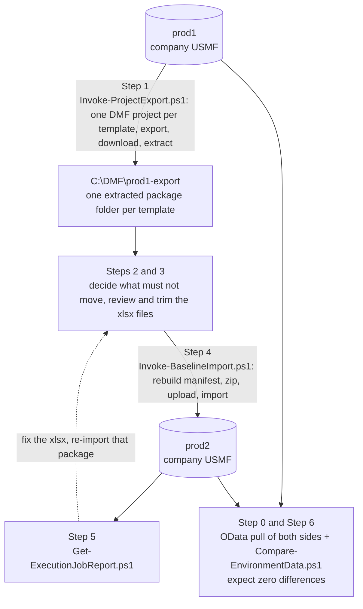

# Use case 1 — Copy one company's setup data from one production environment to another

You run two production environments (call them **prod1** and **prod2**) and want the configuration of one company in prod1 — parameters, groups, posting profiles, dimensions, calendars, and the rest of the module setup — to exist in prod2 as well.  Typical reasons: a second region or subsidiary goes live on its own environment, or a company is being split out.

This guide moves the **setup data** that Microsoft's default templates cover (the numbered `010 … 650` templates under `resources/`).  It does not move customers, vendors, products, on-hand inventory or open transactions; [use case 2](02-open-transactions-prod-to-uat.md) covers open orders.

Every command below is run from the repository root.  Both environments are production, so read the [safety checklist](#before-you-start) first.

---

## What happens, in one picture



---

## Before you start

- **Restore point.**  Take a database backup or note the point-in-time restore window for prod2 before the first import.  DMF imports overwrite by default (`-NoOverwrite` preserves existing rows but still inserts new ones).
- **Change window.**  Setup entities such as *System parameters*, *Number sequence code* and *Legal entities* affect every user in prod2 the moment they land.
- **Same company ID.**  Import into the same legal-entity ID (USMF → USMF) whenever you can.  The import runs against the legal entity you pass, so a different ID also works, but check the xlsx files for values that embed the company code (default dimensions, number-sequence codes, posting profiles named after the company) before importing.
- **Same version.**  Entity schemas change between platform updates.  Export and import on the same, or very close, application versions, or expect a few *Changed* schema-drift rows in the compare and staging errors for renamed columns.
- **Both environments in the same tenant** are the simplest case: one sign-in per script run.  Different tenants work too; pass the right `-TenantId` to each side.
- **Do a dry run first.**  Every script accepts `-WhatIf`; with a local template it makes no API calls at all.

---

## Step 0 — Know the gap (optional, recommended)

Pull the entities of the templates you intend to move from **both** environments and compare them.  This tells you what the import will change before anything moves, and it is the same command you use to prove convergence at the end.

```powershell
$tenant = 'contoso.onmicrosoft.com'
$prod1  = 'https://contoso-prod1.operations.dynamics.com'   # snapshots land in C:\DMF\snapshots\contoso-prod1\USMF
$prod2  = 'https://contoso-prod2.operations.dynamics.com'   # ...and C:\DMF\snapshots\contoso-prod2\USMF

.\Invoke-ProjectExport.ps1 -EnvironmentUrl $prod1 -TenantId $tenant -LegalEntityId 'USMF' -All -Mode OData -DataPath 'C:\DMF\snapshots' -Force
.\Invoke-ProjectExport.ps1 -EnvironmentUrl $prod2 -TenantId $tenant -LegalEntityId 'USMF' -All -Mode OData -DataPath 'C:\DMF\snapshots' -Force

.\Compare-EnvironmentData.ps1 -Folder1 'C:\DMF\snapshots\contoso-prod1\USMF' -Folder2 'C:\DMF\snapshots\contoso-prod2\USMF' -HtmlPath 'C:\DMF\snapshots\gap-before.html'
```

`-Mode OData` reads the entities directly and creates nothing in either environment.  Entities that are not OData-enabled are listed as `NotPublic` and simply do not take part in the compare; the DMF import still moves them.  The HTML report has a per-template table, so you can see at a glance which packages differ and by how much.  Reading the outputs, and deciding what to ignore, is covered in [use case 3](03-compare-a-package-between-environments.md).

---

## Step 1 — Export from prod1

Export every numbered template for the company, one extracted package folder per template:

```powershell
.\Invoke-ProjectExport.ps1 `
    -EnvironmentUrl $prod1 `
    -TenantId       $tenant `
    -LegalEntityId  'USMF' `
    -All `
    -DownloadPath   'C:\DMF\prod1-export' `
    -PollIntervalSeconds 10 `
    -Force
```

What to expect:

- One DMF data project named `<template> USMF` is created in prod1 per template (an existing project of that name is deleted first).  Nothing else is written to prod1.
- Each template lands as `C:\DMF\prod1-export\<template>-USMF_<timestamp>\` holding `Manifest.xml`, `PackageHeader.xml` and one xlsx per entity — a complete package.
- Sign-in happens once; the token is refreshed silently for the length of the run.  A whole-environment sweep takes a while (tens of minutes to a few hours depending on the environment), so `-PollIntervalSeconds 10` is worth setting.
- The summary table shows `Succeeded`, `Skipped` (template has no lines) or an error per template.  Re-run a single one with `-TemplateName '<template>'`.

To move only some modules, replace `-All` with the interactive menu (omit `-All`, pick numbers or ranges) or run once per `-TemplateName`.  The numbered templates encode their dependency order — `010` before `020` before `025`, and so on — keep that order when importing.

> `resources/` also holds Microsoft's newer consolidated templates (*System and shared*, *Financials*, *Supply chain management*, …).  They overlap the numbered set (all three carry *Number sequence code*, for example).  Pick one family and stay with it.

---

## Step 2 — Decide what must not move

Some lines in the default templates carry state that belongs to prod2, not prod1.  Review these before importing, and either delete the rows from the xlsx or disable the lines in a local copy of the template before Step 1 so they are never exported:

| Template line | Why it needs a decision |
|---|---|
| *Number sequence code* (010, 020, System and shared) | Carries the **next number** of every sequence.  Importing it resets prod2's counters to prod1's — fine for a company that has never transacted in prod2, destructive for one that has. |
| *Number sequence references* / *Number sequence group* | Safe to move if the codes exist in prod2; import after the codes. |
| *Legal entities* (010) | Creates or updates the company record itself (name, addresses, registration numbers). |
| *User information*, *Security user role association*, *User to person relationship* (010) | prod1's users and role assignments.  Usually you want prod2's. |
| *System parameters*, *Global address book parameters*, *Address parameters* (010) | Environment-wide, not company-wide. |
| *System email template* / *System email template message* (010) | Environment-wide. |
| *Fiscal calendar* / *Fiscal calendar period* (010) | Shared across companies; period statuses (open/closed) come with them. |
| *Exchange rates* (010) | Shared; a large table that changes daily — decide whether prod2 should own its own feed. |

To disable a line for good, copy the template folder (say `010 - System Setup` → `010 - System Setup (prod2)`), set `<Disable>true</Disable>` on the line in the copy's `Manifest.xml`, and use the copy's name with `-TemplateName`.  The folder name becomes the DMF project name and the package name, so keep it unambiguous.

Shared entities (no `dataAreaId` column — currencies, countries, units, chart of accounts) apply to **all** companies in prod2, not just USMF.  That is normally what you want for a first company on a new environment; on an environment that already has live companies, compare those entities in Step 0 before deciding.

---

## Step 3 — Review and trim the packages

Open the xlsx files under `C:\DMF\prod1-export\…` and remove the rows you decided against in Step 2.  Leave the manifest alone: `Invoke-BaselineImport.ps1` rebuilds it, applies the built-in execution ordering for the foundation entities it knows, and keeps the exported ordering for everything else.

Then validate every package without touching D365:

```powershell
.\Invoke-BaselineImport.ps1 -EnvironmentUrl $prod2 -TenantId $tenant -LegalEntityId 'USMF' -ResourcesPath 'C:\DMF\prod1-export' -WhatIf
```

The plan lists each package, its entity count, and any warnings (an xlsx that no manifest line names, a manifest line with no file).

---

## Step 4 — Import into prod2, in order

Interactive: run without `-WhatIf`, select the packages in numbered order (the menu is sorted by folder name, so `010-…`, `020-…`, `025-…` come out in dependency order), confirm.

Unattended: import one package at a time and stop at the first one that does not succeed, so a failed prerequisite never leaves dependent packages half-applied:

```powershell
$company    = 'USMF'
$exportRoot = 'C:\DMF\prod1-export'
$order      = '010 - System Setup', '020 - GL Shared', '022 - Workflow', '025 - General ledger',
              '100 - Bank', '120 - Accounts payable', '130 - Tax', '140 - Accounts receivable',
              '150 - Fixed assets', '160 - Budgeting', '300 - Inventory', '310 - Product information management',
              '320 - Procurement and sourcing', '330 - Sales and marketing', '395 - Quality management',
              '400 - Warehouse management', '405 - Transportation management', '410 - Production control',
              '412 - Process manufacturing', '418 - Product configuration models', '420 - Costing',
              '430 - Master planning', '500 - Retail', '600 - Expense', '650 - Project accounting'

foreach ($template in $order) {
    # Invoke-ProjectExport names the folder "<template> <company>" with non-alphanumerics collapsed to '-', plus _<timestamp>
    $safe = ("$template $company" -replace '[^A-Za-z0-9]', '-') -replace '-{2,}', '-'
    $pkg  = Get-ChildItem $exportRoot -Directory -Filter "${safe}_*" | Sort-Object Name | Select-Object -Last 1
    if (-not $pkg) { Write-Warning "No export found for '$template' -- skipped"; continue }

    $result = .\Invoke-BaselineImport.ps1 -EnvironmentUrl $prod2 -TenantId $tenant -LegalEntityId $company `
                  -ResourcesPath $exportRoot -PackageName $pkg.Name -PollIntervalSeconds 10 -Force -PassThru
    if ($result.Status -ne 'Succeeded') { Write-Warning "'$template' finished with status '$($result.Status)' -- stopping"; break }
}
```

Add `-NoOverwrite` if prod2 already has rows you want to keep untouched; the import then only inserts.

---

## Step 5 — Check the job results

```powershell
.\Get-ExecutionJobReport.ps1 -EnvironmentUrl $prod2 -TenantId $tenant -IssuesOnly -HtmlPath 'C:\DMF\prod1-export\import-issues.html'
```

Red rows are entities with staging or target errors.  The usual causes on a setup migration are a referenced value that does not exist yet in prod2 (a posting profile that names a main account, a dimension value whose dimension was disabled in Step 2) and column renames between versions.  Fix the xlsx, re-run Step 4 for that package only (`-PackageName`), and re-check.

---

## Step 6 — Prove convergence

Re-pull prod2 and compare it with the prod1 snapshot from Step 0.  Every template you imported should show no differences apart from the rows you deliberately left out:

```powershell
.\Invoke-ProjectExport.ps1 -EnvironmentUrl $prod2 -TenantId $tenant -LegalEntityId 'USMF' -All -Mode OData -DataPath 'C:\DMF\snapshots' -Force

.\Compare-EnvironmentData.ps1 -Folder1 'C:\DMF\snapshots\contoso-prod1\USMF' -Folder2 'C:\DMF\snapshots\contoso-prod2\USMF' `
    -ChangesOnly -HtmlPath 'C:\DMF\snapshots\gap-after.html' -FailOnDifference
```

`-FailOnDifference` exits with code 2 when anything differs, which makes the command usable as a gate in a runbook.  Narrow the view with `-Template '025 - General ledger'` or `-Entity 'Customer groups', 'Vendor groups'`, and export the field-level detail with `-PassThru | Export-Csv`.

Rows that will legitimately differ, and how to hide them:

- audit columns and `RecId`-style surrogates are ignored by default;
- `dataAreaId` is compared — add `-IgnoreFields dataAreaId` if you imported into a differently named company;
- number-sequence *next numbers* if you skipped that line — add `-Entity` filters or accept those rows.

---

## Repeating the run

The whole procedure is idempotent from prod1's point of view (projects are recreated on every export) and from prod2's (overwrite import).  Keep the `C:\DMF\prod1-export\…` folders with the trimmed xlsx files as the record of exactly what was applied; they are complete packages and can be re-imported as they are, or dropped under `resources/` to become templates for the next environment.
