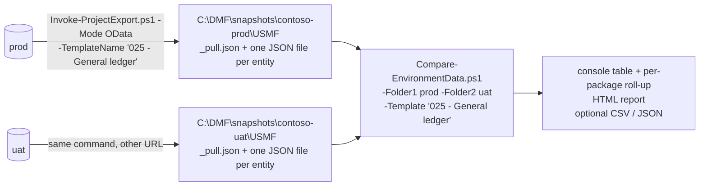

# Use case 3 — Compare one data package between two environments

The question is "is package *025 - General ledger* the same in prod and UAT, and if not, what exactly differs?"  The answer comes from two OData snapshots and one local compare.  The same procedure answers "did the import land as intended" (compare after importing), "how do these two companies differ" and "what changed since last week" (compare two snapshots of the same environment).

Every command below runs from the repository root.  Nothing here writes to D365.

---

## How it works



`_pull.json` records which template pulled which entity and how the pull went; the entity files hold the rows.

`-Mode OData` reads each entity of the template straight from `/data/<collection>` and writes one JSON file per entity.  No DMF project is created and nothing is exported; a pull of a setup package takes seconds to minutes.  The compare works only on those files.

---

## Step 1 — Pull the package from both environments

```powershell
$tenant  = 'contoso.onmicrosoft.com'
$package = '025 - General ledger'
$root    = 'C:\DMF\snapshots'

.\Invoke-ProjectExport.ps1 -EnvironmentUrl 'https://contoso-prod.operations.dynamics.com'         -TenantId $tenant -LegalEntityId 'USMF' -TemplateName $package -Mode OData -DataPath $root -Force
.\Invoke-ProjectExport.ps1 -EnvironmentUrl 'https://contoso-uat.sandbox.operations.dynamics.com' -TenantId $tenant -LegalEntityId 'USMF' -TemplateName $package -Mode OData -DataPath $root -Force
```

The snapshot lands in `<DataPath>\<environment>\<legal entity>\`, where `<environment>` is the first label of the URL host (`contoso-uat.sandbox.operations.dynamics.com` → `contoso-uat`).  Pull the **same legal entity** on both sides; company-specific entities are read with `cross-company=true` and a `dataAreaId` filter so each folder holds that company's rows only.

Each pull ends with one line per entity.  What the status means for the compare:

| Status | Meaning | For the compare |
|---|---|---|
| `Pulled` | file written | compared |
| `Truncated` | capped by `-MaxRecordsPerEntity` | compared, but Added / Removed counts are meaningless — re-pull without the cap |
| `NotPublic` | entity is not OData-enabled | cannot be compared this way; the DMF export still moves it |
| `Unresolved` | label could not be mapped to an OData collection | seed `entity-map.json` (below) and re-pull |
| `Failed` | HTTP error | a previous good file is kept if there was one; re-pull |

If several entities are `Unresolved`, harvest the AOT names from any expanded DMF export of the package first — no sign-in needed:

```powershell
.\Export-TemplateDefinition.ps1 -EnvironmentUrl 'https://contoso-prod.operations.dynamics.com' -TenantId $tenant -SeedFromPath 'C:\DMF\prod1-export'
```

A re-pull overwrites the entity files in place and **merges** `_pull.json`, so one folder can accumulate several packages over time (`-All` pulls every local template in one go).  The `templates` list stored per entity is what `-Template` filters on later.

---

## Step 2 — Compare

```powershell
.\Compare-EnvironmentData.ps1 `
    -Folder1  "$root\contoso-prod\USMF" `
    -Folder2  "$root\contoso-uat\USMF" `
    -Template $package `
    -HtmlPath "$root\$package prod-vs-uat.html"
```

Folder 1 is the **baseline** (Reference); folder 2 is the side being examined (Difference).  Rows only in folder 2 are *Added*, rows only in folder 1 are *Removed*, rows with the same key but different field values are *Changed*.  Put the environment you trust in folder 1 and the report reads as "what UAT has that prod does not".

`-Template` keeps the entities that either side's `_pull.json` attributes to the package (wildcards allowed: `'02*'`).  Without it every entity in the folders is compared.  With `-Reference 'contoso-prod/USMF' -Difference 'contoso-uat/USMF'` the same folders are resolved under `-DataPath` (default `./data`).

---

## Step 3 — Read the result

**Console.**  One row per entity, then the totals, then the roll-up per package:

```
--- Result  --  4 entities  |  <1s ------------------------------------------------------------------
  Entity                    Ref     Diff   Added  Removed  Changed  Notes
  ---------------------- ------- -------- ------- -------- -------  --------------------
  Currencies                  3        3       1        1        1  SchemaDrift(1)
  Customer groups             2        2       0        0        0
  Sites                       -        -       -        -        -  only in Difference (Reference side: NotPublic -- DataServiceEnabled=false)
  Units                       -        -       -        -        -  only in Reference (Difference side: Failed -- HTTP 500)
  2 compared: 1 identical, 1 with changes  |  rows: +1 -1 ~1  |  schema drift: 1  |  one side only: 2  |  warnings: 1
--- By template (package) ---------------------------------------------------------------------------
  Template                 Entities Identical  Changed   Added  Removed    ~Rows  Notes
  ------------------------ -------- --------- -------- ------- -------- --------  ------------
  010 - System Setup              2         1        1       1        1        1
  020 - GL Shared                 2         0        1       1        1        1  1 only in Reference
```

- `Ref` / `Diff` are record counts on each side; `Added` / `Removed` / `Changed` are records; `~Rows` in the roll-up is the changed-record total.
- `Notes` explains anything that is not a plain data difference: `SchemaDrift(n)` means *n* fields exist on one side only (a version difference, not data); `only in Reference` / `only in Difference` carries the other side's reason from `_pull.json`; `KeyCollision(n)` means the stored key does not identify rows uniquely and `KeylessComparison` that no key was available at all, so only Added / Removed could be detected (see Step 4); `Truncated` flags a capped pull.
- An entity that belongs to several packages is counted under each of them, so the roll-up can list a package you did not ask for — above, *Currencies* is in both `010` and `020`.
- Colours: green rows are identical, yellow rows have changes or something worth a look (drift, truncation, keyless), red rows need attention (a failed or unresolved pull on the other side, a key collision), grey rows are one-sided for a benign reason (not OData-enabled, not in scope).  The summary line is green only when nothing differs at all.  `-ChangesOnly` hides identical rows without notes.

**HTML report** (`-HtmlPath`; default `%TEMP%\DMFDataDiff_<timestamp>.html`, `''` to skip).  Self-contained file with the summary block, a *Coverage* section (which entities took part and why the others did not), the *By template* table, and one section per entity with the added and removed records in full and every changed field as before / after.  The filter box at the top narrows every table by entity, key, field or value — the quickest way to answer "where does *Main account 110110* differ".  Rows per entity are capped at `-MaxRowsPerEntity` (500); the console and CSV never are.

**CSV**, for anything that needs a spreadsheet or a ticket:

```powershell
.\Compare-EnvironmentData.ps1 -Folder1 "$root\contoso-prod\USMF" -Folder2 "$root\contoso-uat\USMF" -Template $package -HtmlPath '' -PassThru |
    Export-Csv "$root\$package delta.csv" -NoTypeInformation
```

One row per finding: `Entity, ChangeType, Key, Field, ReferenceValue, DifferenceValue, Record`, where `ChangeType` is `Added`, `Removed`, `Changed`, `EntityOnlyInReference`, `EntityOnlyInDifference`, `SchemaDrift` or `KeyCollision`.  A *Changed* record produces one row per changed field:

```
Entity      ChangeType  Key               Field  ReferenceValue  DifferenceValue
Currencies  Changed     CurrencyCode=AED  Name   UAE Dirham      United Arab Emirates Dirham
Currencies  Added       CurrencyCode=USD
Currencies  Removed     CurrencyCode=OLD
```

**JSON** (`-JsonPath`), for tooling: the two folders, the ignore list, the template filter, the per-template roll-up, and per entity the key fields, counts, schema drift and the full added / removed records and changed fields.

---

## Step 4 — Decide what counts as a difference

- **Ignored by default:** `@odata.etag`, the `Created*` / `Modified*` audit fields, and `RecId` / `RecVersion`-style surrogates.  Add your own with `-IgnoreFields 'Description', 'Last*'` (wildcards allowed); an ignored field is also dropped from the key.  `-NoDefaultIgnores` compares everything, which turns every row touched since the last refresh into a *Changed* row on its audit fields — rarely what you want.
- **Normalisation** is on unless `-Strict`: blanks equal null, `Yes`/`No` equal `true`/`false`, `1.50` equals `1.5`, ISO dates compare as instants, and D365's "no date" value `1900-01-01` equals null.  Use `-Strict` only when the raw text matters.
- **Key.**  Records are matched on the entity's OData key stored in each file.  If the console shows `KeyCollision`, or a key field is one you ignore, supply the right one: `-KeyOverride @{ 'Financial dimension values' = 'DimensionName', 'DimensionValue' }`.
- **`dataAreaId`** is compared.  When the two sides are different companies, add `-IgnoreFields dataAreaId`, otherwise every company-specific row is *Changed*.
- **Schema drift** (a field present on one side only) is a version difference.  Compare environments on the same application version, or accept the note; it never affects the record-level result because only common fields are compared.
- **Truncated** entities: fix the pull, do not interpret the counts.

---

## Variations

**Two companies in one environment** — pull both, ignore the company column:

```powershell
.\Invoke-ProjectExport.ps1 -EnvironmentUrl 'https://contoso-uat.sandbox.operations.dynamics.com' -TenantId $tenant -LegalEntityId 'USMF' -TemplateName $package -Mode OData -DataPath $root -Force
.\Invoke-ProjectExport.ps1 -EnvironmentUrl 'https://contoso-uat.sandbox.operations.dynamics.com' -TenantId $tenant -LegalEntityId 'DEMF' -TemplateName $package -Mode OData -DataPath $root -Force
.\Compare-EnvironmentData.ps1 -Folder1 "$root\contoso-uat\USMF" -Folder2 "$root\contoso-uat\DEMF" -Template $package -IgnoreFields dataAreaId
```

Shared entities (no `dataAreaId`) come out identical, as they should; the interesting rows are in the company-specific ones.

**Before and after a change in the same environment** — the folder name comes from the URL, so use a different `-DataPath` root for each point in time:

```powershell
.\Invoke-ProjectExport.ps1 -EnvironmentUrl $uat -TenantId $tenant -LegalEntityId 'USMF' -TemplateName $package -Mode OData -DataPath 'C:\DMF\before' -Force
# ... import the package, change the setup, run the upgrade ...
.\Invoke-ProjectExport.ps1 -EnvironmentUrl $uat -TenantId $tenant -LegalEntityId 'USMF' -TemplateName $package -Mode OData -DataPath 'C:\DMF\after' -Force
.\Compare-EnvironmentData.ps1 -Folder1 'C:\DMF\before\contoso-uat\USMF' -Folder2 'C:\DMF\after\contoso-uat\USMF' -Template $package
```

**Whole environment** — pull with `-All` on both sides and compare without `-Template`; the roll-up then shows every package on one screen.  Add `-ChangesOnly` to keep the console readable, and use `-Template` or `-Entity 'Number sequence*'` afterwards to zoom in.

**As a gate** — `-FailOnDifference` exits with code 2 when anything differs and 0 when the two sides are identical:

```powershell
.\Compare-EnvironmentData.ps1 -Folder1 "$root\contoso-prod\USMF" -Folder2 "$root\contoso-uat\USMF" -Template $package -ChangesOnly -FailOnDifference
if ($LASTEXITCODE -eq 2) { Write-Warning "$package differs between prod and UAT -- see the HTML report" }
```

---

## When the result looks wrong

| You see | Cause | Do |
|---|---|---|
| `only in Reference (Difference side: NotPublic …)` | the entity is not OData-enabled | nothing to compare here; verify that entity through the DMF export or the job report |
| `Unresolved` for many entities in the pull | the entity map lacks the AOT names | seed with `-SeedFromPath` from an expanded export, or `-RefreshEntityMap` |
| every entity *Changed* on `ModifiedDateTime` | `-NoDefaultIgnores` | drop it, or ignore the audit fields explicitly |
| `KeyCollision(n)` | the stored key does not identify rows | `-KeyOverride` for that entity; fix the entry in `entity-map.json` (`"keyFields"`) to make it permanent |
| all company rows *Changed* on `dataAreaId` | two different companies | `-IgnoreFields dataAreaId` |
| counts differ but the package was just imported | `Truncated` pull, or the import wrote to another company | re-pull without a cap; check the legal entity on both commands |
| a package you did not ask for appears in the roll-up | an entity belongs to more than one package | expected; the entity is listed under each |
